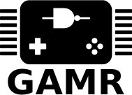

This is an electronics hacking project that involves building
a [TerasIC DE0-Nano FPGA board][TerasIC] into a simplistic, fun, and
retargetable handheld gaming console.

[TerasIC]: http://www.terasic.com.tw/cgi-bin/page/archive.pl?Language=English&CategoryNo=139&No=593&PartNo=1

## Design

The console consists of three major parts:

  - The Left and Right controller (both using the same components and basic
    schematic -- only the board art is different)
  - The TFT LCD backlight, power, and audio amp board
  - Adapters for the speakers

This repository contains the Eagle 8.x projects, the Altera Cyclone IV VHDL
source code for the cores, as well as a few bits of software written for the
console.

## Spirit of the Project

The idea is to make this as drop-dead simple to build as possible, minus the
fabbing of the boards. As a result, it'll use mostly through-hole components,
0608-class SMT parts if absolutely necessary, and 0.1" headers wherever
interconnects are required. Everything should be hand-assembleable by someone
with minimal electronics experience without expensive rework stations.

Component counts should be kept as minimal as possible. Anything that could
typically be done using a piece of discrete hardware (say, a SID chip, or a
fancy DAC, video controller, CPU, etc.) should ideally be done in the FPGA to
keep things as simple and malleable as possible.

The boards included in this repository will likely be built using OSHpark
or some other OSS-friendly project, so just look for the "GAMR" acronym in their
catalogs.

As of this writing, the following boards are now in production:

  * [Left Controller][left-controller]
  * [Right Controller][right-controller]

[left-controller]: https://oshpark.com/shared_projects/AXFgIkdE
[right-controller]: https://oshpark.com/shared_projects/QkbYnFhj

## Why "GAMR"? What's it mean?

I dunno. PiGrrl, GameGrrl, FPGamer... GAMR. Doesn't really mean anything -- I
needed a name, so I chose that. =o)

## License

This project is placed under the WTFPL. You can do what the f--- you'd like with
it. Depending on whether or not more people get involved, I may change this to
something more sane if folks would like to collaborate more. One thing to note:
I'm not planning on making money on it, but maybe you can on Tindie. =o)
